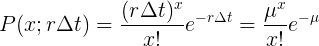

# Task 4

In this lab we will use data collected from the Sr90 source used in the previous labs. The number of β− decay reactions, x, occurring from our Sr90 sample within a given time interval ∆t, was collected for different lengths of time T.

If we look at the Poisson distribution:

We can find the rate, r, if we fit plot out μ values found from each histogram versus the time interval ∆t.

-   [ ] [Download Sr90 root Data](http://boson.physics.sc.edu/~nick/root_data.html)
    -   The data is labeled by the ∆t and T of the data: ∆t-T.root
-   [ ] Plot data from all the files into histogram.
-   [ ] Fit Poisson function to all the histograms.
-   [ ] Extract the value μ for all the histograms.

After you have extracted the μ values from each of the files use the labeling of the files to:
-   [ ] Plot μ versus ∆t from the different runs to determine whether the rate is constant.
-   [ ] Calculate the detected event rate, r.

### Extra Questions

-   [ ] Determine whether or not you can calculate the activity a for this sample of Sr90 from r. Are they the same? How is a related to r?
-   [ ] Investigate for which ∆t and T a Gaussian would work well for fitting the data and extracting the mean m and hence r. Use the χ2 statistic to justify your claims.

## Helpful Documentation

[Fitting in ROOT](https://root.cern.ch/root/html534/guides/users-guide/FittingHistograms.html)
[TF1](https://root.cern.ch/doc/v612/classTF1.html)
[TGraph](https://root.cern.ch/doc/master/classTGraph.html)
