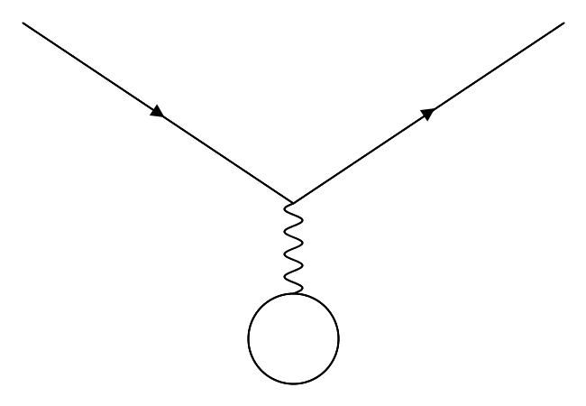

# Task 5

In the final two labs we will be looking at experimental data from the CLAS detector at JLAB. The experimental we will be looking at is an electron scattering experiment with a beam energy of 4.8GeV, along the Z axis, on a liquid hydrogen (proton) target.

The root/csv file has the information from the scattered electron stored in 4 banks. The momentum is stored in "p" and the cosine of the angle from the beam line is gives in the x, y, and z are given by the "cx", "cy", and "cz" banks respectively. Therefore to get the momentum of the electron in the x direction, Px  = P \* Cx.

This week we will look at calculating W and Q^2 values from the scattered electrons.

## Physics Calculations

-   [ ] Write down the electron beam 4 vector.
-   [ ] Write down the proton target 4 vector.
-   [ ] Write down the scattered electron 4 vector.
-   [ ] Determine how to get the invariant mass, W from your 4 vectors.
    -   Hint: s channel.
-   [ ] Determine the energy transfer, Q^2.
    -   Hint: t channel.

## Programming

-   [ ] [Download data](http://boson.physics.sc.edu/~nick/electron-scattering-data.html)
-   [ ] Look at the c++ macro or python notebooks.
-   [ ] Create a 4 vector for the Electron beam, e_mu.
-   [ ] Create a 4 vector for the Proton target, p_mu.
-   [ ] Create a 4 vector for the scattered Electron beam, e_mu_prime.
-   [ ] Write a function to calculate W.
-   [ ] Write a function to calculate Q^2.
-   [ ] For each event calculate W and Q^2 and plot them in their histograms.

## Graphs

-   [ ] TH1D for W
-   [ ] TH1D for Q^2
-   [ ] TH2D for W vs Q^2

## Helpful Documentation

[TLorentzVector](https://root.cern.ch/doc/master/classTLorentzVector.html)

[TH1D](https://root.cern.ch/doc/master/classTH1D.html)

[TH2D](https://root.cern.ch/doc/master/classTH2D.html)
